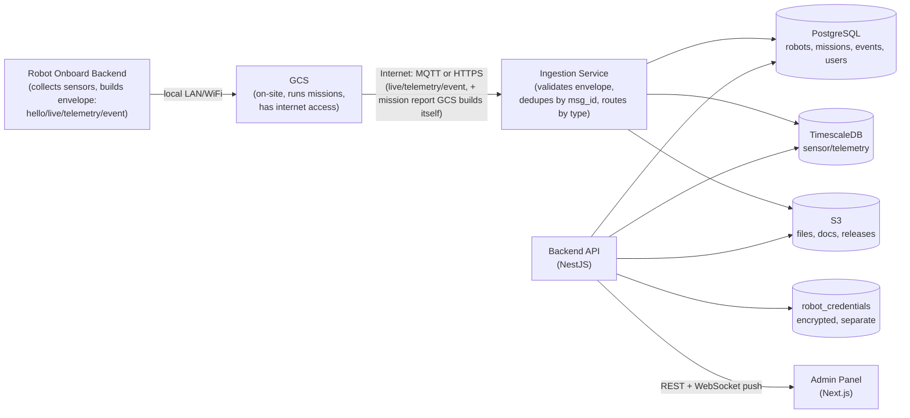

# Arnobot Admin — Project Structure & Tech Stack

Derived from `Arnobot_PMS_Robot_Record_Spec` (v1, 27 Sept 2026).
This picks a concrete stack + folder layout so the spec's rules (stable message
format, append-only history, encrypted credentials, offline buffering, S3
versioning, `can(user, action, target)` permissions) are easy to implement
correctly and hard to violate by accident.

---

## 1. Tech Stack

| Layer | Choice | Why (tied to spec) |
|---|---|---|
| **Backend API** | Node.js + TypeScript, **NestJS** | Spec has a rich permission model (`can(user, action, target)`), many entities with history tables, and strict env-var rules (`GCS_API_TOKEN` server-only). NestJS's modules/guards/interceptors map cleanly onto "one check per request" and per-module ownership of each Section 3 entity. |
| **Frontend (Admin Panel)** | **Next.js 14 (App Router) + TypeScript** | Spec already assumes Next.js conventions (`NEXT_PUBLIC_CAMERA_DOMAIN`, `NEXT_PUBLIC_SERVER_DOMAIN`, and the explicit warning *not* to use `NEXT_PUBLIC_GCS_API_TOKEN`). Keeping the admin panel on Next.js keeps that convention consistent with the GCS app. |
| **Database (structured)** | **PostgreSQL 15+** | Explicitly specified. Holds robots, products, ownership history, mission metadata, events, users/roles. |
| **Database (time-series)** | **TimescaleDB** (Postgres extension) | Explicitly specified for Section 11 Sensor Data (GPS track, encoders, battery/health history) — append-only, high write volume. |
| **File storage** | **S3** (or S3-compatible, e.g. MinIO for local dev) | Explicitly specified for videos, MCAP, images, PDFs, update packages. Bucket **versioning on** per spec Section 8. |
| **ORM / migrations** | **Prisma** | Spec requires "database changes are numbered migrations" (Section 8) — Prisma Migrate gives numbered, reversible migration files out of the box. |
| **Robot message transport** | **MQTT** (recommended), HTTPS webhook as fallback | Spec leaves this open ("chosen during the build," Section 6). MQTT fits field robots with intermittent connectivity and the offline-buffer-then-resend behavior (Section 11) far better than polling HTTPS. Use a broker (EMQX or Mosquitto) in front of a small ingestion service. |
| **Credentials store** | Separate encrypted table `robot_credentials`, app-level envelope encryption (e.g. `libsodium` / AWS KMS-wrapped keys) | Spec Section 10: encrypted, stored separately from `robots`, keys kept outside the database. |
| **Live updates to admin panel** | **WebSockets** (Socket.IO or native `ws`) | Live State (Section 3.10) is overwritten every ~30s; the admin panel needs push updates rather than polling. |
| **Auth** | JWT (short-lived access + refresh) for admin users; per-robot credentials (Section 10) for robots | Two separate auth domains — humans vs. robots — matching the spec's "the robot does not know the business hierarchy" rule. |
| **Maps (mission paths)** | **MapLibre GL** or **Leaflet** | Section 5 admin panel needs a map showing planned vs. actual path per mission. |
| **Monorepo tooling** | **Turborepo** + npm/pnpm workspaces | Backend, frontend, and ingestion service share types (message envelope, DB schema) — a monorepo avoids drift. |
| **Infra (local dev)** | Docker Compose: Postgres+Timescale, MinIO, MQTT broker, backend, frontend | Lets you run the whole stack (robot simulator included) without cloud accounts. |

---

## 2. High-Level Architecture



### Data flow, step by step

1. **Robot onboard backend** — runs on the robot's controller. Reads sensors (GPS, encoders, battery, temps, device health) and assembles the standard message envelope (Section 6 of the spec: `hello` / `live` / `telemetry` / `event`). Sent over the **local network only** — this is the `Wi-Fi router IP` / `OMNI IP address` link recorded per robot in Section 3.5. No internet hop yet.
2. **GCS** — the on-site machine, the only thing with internet access in this hop. It relays the robot's messages onward, and — separately — once a mission ends, GCS itself compiles the mission report (planned path it already had, plus the robot's actual path) and sends that as a `type: "mission"` message. This is explicit in the spec: *"The GCS creates and runs the mission. After the mission is finished, the GCS sends the completed mission report to the PMS."* Transport is MQTT (recommended) or HTTPS — GCS's own connectivity is the only thing that needs to survive drops here, not the robot's.
3. **Ingestion service (ours)** — the only endpoint GCS talks to over the internet. Validates the envelope, dedupes by `msg_id` ("the PMS stores each message once"), then routes by `type`: `live` overwrites `live_state`, `telemetry` appends to TimescaleDB, `event` appends to `events`, `mission` writes `missions`/`mission_files` (large files to S3, path only in Postgres).
4. **Database layer** — Postgres, TimescaleDB, S3, and the separate encrypted `robot_credentials` store, exactly as split in Section 8/10.
5. **Backend API** — never talks to GCS or the robot. Reads/writes the DB on behalf of authenticated admin users, and pushes changes out over WebSocket the moment ingestion updates `live_state` or appends a new event/mission — so the admin panel doesn't poll.
6. **Admin webapp (Next.js)** — pure consumer of the backend API (REST for lists/detail pages) + a WebSocket subscription (for live status, telemetry ticks, new events).

> **Connectivity model — default assumption.** The spec's wording ("the robot does not know the business hierarchy," GCS as the thing that "creates and runs the mission" and sends reports) points to **GCS relaying all traffic** for every robot, which is what the diagram above assumes. But each robot also has its own `Cloudflare Tunnel hostname` recorded (Section 3.5), which leaves room for a robot to reach the internet directly later. To avoid re-architecting if that happens: the ingestion service authenticates **per connection**, not per payload — each connecting client (GCS or a robot) presents its own credential (Section 10, `robot_credentials` / a GCS service credential), and the envelope's `robot_id` is only trusted once that connection is authenticated. That way a direct robot connection is just another authenticated client hitting the same ingestion endpoint — no schema or handler changes needed.

---

## 3. Repository Layout (monorepo)

```
arnobot-pms/
├── apps/
│   ├── api/                 # NestJS backend (REST/GraphQL + permissions)
│   ├── admin/                # Next.js admin panel
│   └── ingest/                # MQTT/HTTPS message ingestion service
├── packages/
│   ├── db/                    # Prisma schema + migrations (shared)
│   ├── message-schema/        # Robot message envelope types + validators (shared by ingest, api, admin)
│   ├── ui/                    # Shared React components (design system)
│   └── config/                # Shared eslint/tsconfig
├── infra/
│   ├── docker-compose.yml     # Postgres+Timescale, MinIO, MQTT broker, api, admin
│   └── migrations/            # (or inside packages/db, see below)
├── .env.example
└── turbo.json
```

---

## 4. Backend (`apps/api`) — mapped to spec Section 3

```
apps/api/
├── src/
│   ├── modules/
│   │   ├── robots/            # Section 3.1 Identity, 3.3 Hardware Fitted
│   │   │   ├── robots.controller.ts
│   │   │   ├── robots.service.ts
│   │   │   └── dto/
│   │   ├── ownership/          # Section 3.2 — company_id + assignment history
│   │   ├── software/            # Section 3.4 + Section 9 release records
│   │   ├── connectivity/        # Section 3.5 (non-secret network fields only)
│   │   ├── credentials/         # Section 3.6 — robot_credentials, encrypted, access-gated
│   │   ├── documents/           # Section 3.7 — versioned docs in S3, product/revision-linked
│   │   ├── dispatch-warranty/    # Section 3.8
│   │   ├── maintenance/          # Section 3.9 — history rows per repair
│   │   ├── live-state/           # Section 3.10 — one row per robot, overwritten
│   │   ├── sensor-data/          # Section 3.11 — reads from TimescaleDB, append-only
│   │   ├── missions/              # Section 5 — missions + mission_files
│   │   ├── events/                 # Section 3.13 — Abort/RTH/Alert/Fault/Update log
│   │   ├── products/                # Section 4 — product catalogue + hardware revisions
│   │   ├── permissions/              # can(user, action, target) — single guard used everywhere
│   │   └── auth/                       # admin user JWT auth
│   ├── common/
│   │   ├── guards/permission.guard.ts   # wraps can(user, action, target)
│   │   └── interceptors/soft-delete.interceptor.ts  # deleted_at, never hard-delete
│   └── main.ts
└── test/
```

**Rules to enforce in code, straight from the spec:**
- Every mutating endpoint routes through one `PermissionGuard` calling `can(user, action, target)` — never inline role checks (Section 12).
- No hard deletes: every delete sets `deleted_at`, restorable (Section 8).
- `robot_credentials` never joined into normal `robots` queries; separate service + separate access check (Section 3.6, Section 10).
- Never read `GCS_API_TOKEN`-equivalent secrets from anything prefixed `NEXT_PUBLIC_*` (Section 10).

---

## 5. Message Ingestion Service (`apps/ingest`)

```
apps/ingest/
├── src/
│   ├── mqtt/subscriber.ts       # subscribes per robot_id topic
│   ├── http/webhook.ts           # fallback HTTPS endpoint
│   ├── handlers/
│   │   ├── hello.handler.ts
│   │   ├── live.handler.ts        # writes live_state (overwrite)
│   │   ├── telemetry.handler.ts    # writes to TimescaleDB (append)
│   │   ├── event.handler.ts         # writes events (append)
│   │   └── mission.handler.ts        # writes missions/mission_files
│   ├── dedupe.ts                       # msg_id uniqueness — store each message once
│   └── status.ts                        # computes Online/Stale/Offline from last-seen
```

Directly implements Section 7 (30s cadence, Online <60s / Stale 60s–5min / Offline >5min) and Section 11 (backlog after reconnect, live state sent first, local 75GB cap with sensor data dropped before events/missions).

---

## 6. Frontend (`apps/admin`) — mapped to spec Section 5

```
apps/admin/
├── app/
│   ├── robots/
│   │   ├── page.tsx              # Robot summary list (Section 5.1)
│   │   └── [robotId]/
│   │       ├── page.tsx            # Robot detail (all Section 3 fields)
│   │       └── missions/
│   │           ├── page.tsx         # Missions of this robot (Section 5.2)
│   │           └── [missionId]/page.tsx  # Mission detail + map (Section 5.3)
│   ├── products/                     # Product catalogue (Section 4)
│   ├── events/                         # Event log (Section 3.13)
│   └── settings/permissions/            # Role/permission management (Section 12)
├── components/
│   ├── mission-map/                     # MapLibre: planned vs actual path
│   ├── robot-status-badge/               # Online/Stale/Offline
│   └── device-health-grid/                # Controller/LiDAR/Cameras/GPS OK/Warning/Fault
└── lib/api-client.ts
```

---

## 7. Database Package (`packages/db`)

```
packages/db/
├── schema.prisma
└── migrations/          # numbered, per spec Section 8 ("database changes are numbered migrations")
```

Core tables straight from Section 3's field table: `robots`, `company_assignment_history`, `hardware_fitted`, `software_state`, `connectivity`, `robot_credentials`, `documents`, `dispatch_warranty`, `maintenance_log`, `live_state`, `missions`, `mission_files`, `events`, `products`, `hardware_revisions`, `releases`, `users`, `roles`, `permissions`.

`sensor_data` (GPS/encoders/battery/health history) lives in TimescaleDB, not this package's default schema — keep it in a clearly separate migration path since it's a hypertable.

---

## 8. Environment Variables (naming discipline from Section 10)

```
# Server-only — never prefix with NEXT_PUBLIC_
GCS_API_TOKEN=
DATABASE_URL=
TIMESCALE_URL=
S3_BUCKET=
S3_ACCESS_KEY=
S3_SECRET_KEY=
CREDENTIAL_ENCRYPTION_KEY=
MQTT_BROKER_URL=

# Public — browser-safe only
NEXT_PUBLIC_CAMERA_DOMAIN=
NEXT_PUBLIC_SERVER_DOMAIN=
```

---

## 9. Suggested Build Order

1. `packages/db` schema for Sections 3.1–3.3 (Identity, Ownership, Hardware) + `products`.
2. `apps/api` robots/products modules + admin auth + permission guard skeleton.
3. `apps/ingest` — `hello`/`live` handlers writing to `live_state`, msg_id dedupe.
4. `apps/admin` — robot list + robot detail page reading live status.
5. TimescaleDB hypertable + `telemetry` handler + sensor history views.
6. Missions (`missions`, `mission_files`) + mission map UI.
7. Documents/versioning (S3 bucket versioning + `documents` table).
8. `robot_credentials` module with encryption, gated separately in permissions.
9. Events log + offline/backlog handling + 75GB local-cache eviction logic on the robot side.
10. Software/firmware release records + update package checksum/signature verification.

---

*This file is a starting structure, not a locked contract — the spec explicitly says fields are only ever added, never renamed or removed, so treat this layout the same way: extend modules rather than reshaping them as customers/Operators/Sites are added later.*
